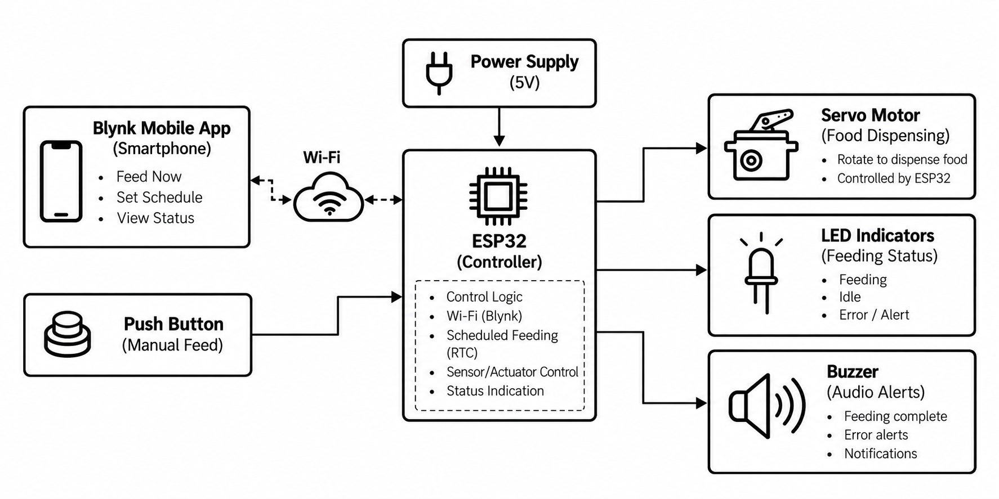

# Smart Pet Feeder — ESP32 & Blynk

An IoT-based automatic pet feeder built using an ESP32, servo motor and Blynk.  
The idea was to make a simple and practical system that can feed a pet automatically while still allowing the owner to control it manually, either using a physical button or a smartphone.

---

## About the Project

Feeding a pet on time can be difficult when you're away from home or have a busy schedule. This project was developed as a way to automate the feeding process using an ESP32.

We started with a basic servo-controlled feeder and gradually added features such as manual feeding, automatic feeding, LED and buzzer indications, and finally Blynk-based remote control and scheduled feeding.

The project was developed and tested step-by-step, with both hardware and software being improved along the way.

---

## How It Works

The ESP32 acts as the main controller of the system.

The feeder can be operated in two ways:

- **Local control** using a physical push button
- **Remote control** using the Blynk mobile application

When a feeding command is received, the ESP32 controls the servo motor, which operates the food dispensing mechanism. LEDs and a buzzer are used to provide feedback during operation.

For scheduled feeding, the ESP32 uses synchronized time through the Blynk/RTC functionality.

---

## System Block Diagram



---

## Features

- Automatic food dispensing
- Manual feeding using a physical push button
- Servo-based food dispensing mechanism
- ESP32-based control
- Blynk IoT integration
- Remote feeding through smartphone
- Scheduled feeding
- RTC-based time synchronization
- LED status indication
- Buzzer alerts
- Wokwi simulation
- Hardware testing and development

---

## Hardware Used

- ESP32 development board
- MG995/MG996 servo motor
- Push button
- LEDs
- Buzzer
- 5V power supply
- Food dispensing mechanism

Circuit diagrams and wiring references are available in the [`hardware`](hardware/) folder.

---

## Software & Tools

- Arduino IDE
- C/C++
- ESP32 Arduino framework
- Blynk IoT
- Wokwi
- VS Code

---

## Blynk Integration

Blynk was added to make the feeder accessible from a smartphone.

The Blynk interface allows the user to:

- Feed the pet manually
- Set a feeding schedule
- View the current feeding/status information

Screenshots of the Blynk interface are available in the [`blynk`](blynk/) folder.

---

## Project Development

The project was developed in multiple stages.

### 1. Basic Feeder

The first version focused on getting the core feeding mechanism working:

- ESP32 control
- Servo motor operation
- Physical button
- Automatic feeding logic
- LEDs
- Buzzer

### 2. Blynk-Enabled Feeder

The project was then extended with:

- Wi-Fi connectivity
- Blynk mobile control
- Remote feeding
- Scheduled feeding
- RTC/time synchronization
- Status indications

The source code for these versions is available in the [`src`](src/) folder.

---

## Simulation & Testing

The project was also tested using Wokwi during development.

The [`simulation`](simulation/) folder contains the available simulation-related files and resources.

---

## Future Improvements

There are several features we would like to add in the next version:

- HX711 and load-cell integration
- Actual food-weight measurement
- Weight-based portion control
- Remaining-food monitoring
- Low-food notifications
- Feeding history and logging
- Better error detection
- Improved mechanical dispensing mechanism

### HX711 Development

A separate HX711/load-cell version has been developed as an experimental extension of the project.

It is **not considered part of the validated main hardware implementation yet**. The next step is to calibrate the load cell, test the weight measurements with the physical setup, and validate weight-based dispensing.

---

## Repository Structure

```text
Smart-Pet-Feeder-ESP32-Blynk/
│
├── src/
│   ├── basic-feeder/
│   └── blynk-feeder/
│
├── hardware/
│   ├── circuit-connections.png
│   ├── circuit-connections-photo.jpeg
│   └── esp32-connections.png
│
├── blynk/
│   ├── blynk-interface.jpeg
│   └── blynk-schedule.jpeg
│
├── simulation/
│
├── docs/
│   └── block-diagram.png
│
├── .gitignore
└── README.md